# ZYTRONA Web Architecture & Platform Memory Rule

> **Authoritative Context & Permanent Memory Rule for ZYTRONA Web Platform**  
> *Target Repository: `c:/project/ZYTRONA_WEB`*  
> *Frameworks: React 19, Vite 8, React Router 7, Tailwind CSS 4, Motion, EmailJS*

---

## 1. Platform Identity & Positioning

- **Company Name**: **ZYTRONA**
- **Tagline**: *"Innovating Tomorrow's Technology Today"*
- **Model**: Senior Software Engineering Studio with direct senior architect collaboration (zero agency middlemen or junior account managers).
- **Core Guarantees**:
  - **100% IP & Code Ownership**: Private Git repository ownership transferred to the client.
  - **Milestone-Backed Delivery**: Disciplined 2-week agile sprints with verified milestone approvals.
  - **Sub-Second Performance**: 98+ Lighthouse score target & sub-250ms TTFB SLA.

---

## 2. Strict Scope of Services

ZYTRONA specializes exclusively in three primary domains:

1. **Web & Enterprise SaaS Platforms** (`/service/website-development`)
   - React 19 & Next.js full-stack web platforms, multi-tenant SaaS architectures, microservices, sub-second Core Web Vitals, and scalable cloud databases (PostgreSQL, Redis).
2. **UI/UX & Product Design Systems** (`/service/ui-designs`)
   - Tokenized Figma design systems, interactive component prototypes, conversion-optimized user journeys, and cross-platform design consistency.
3. **Cloud, Microservices & AI Architecture** (Highlighted in Hero Slide 1, system architecture diagrams, and service specifications)
   - Docker/Kubernetes container orchestration, AWS cloud infrastructure, serverless APIs, and AI workflow automation.

> [!IMPORTANT]
> **Mobile App Engineering Deprecation**: Mobile App Engineering has been intentionally and permanently removed from active service offerings, navigation menus, and footers. Any attempt to access `/service/app-development` must cleanly redirect to `/service/website-development`.

---

## 3. Nexcent-Inspired Boxy Design System

The platform combines the **Nexcent Figma Design System** with modern boxy cards and dark mode capabilities.

### 3.1 Color Palette

| Token Name | Light Mode Hex | Dark Mode Hex | Usage |
|---|---|---|---|
| `--color-primary` | `#4CAF4F` | `#4CAF4F` | Nexcent Signature Green (CTAs, active states, accents) |
| `--color-primary-dark` | `#388E3C` | `#388E3C` | Hover state for primary buttons and dark accents |
| `--color-primary-light` | `#66BB6A` | `#66BB6A` | Badges, borders, and secondary accents |
| `--color-primary-tint` | `#E8F5E9` | `rgba(76, 175, 79, 0.15)` | Chip backgrounds, subtle active state fills |
| `--color-primary-glow` | `rgba(76, 175, 79, 0.2)` | `rgba(76, 175, 79, 0.3)` | Elevation shadows, ambient glow orbs |
| `--color-dark` | `#263238` | `#ECEFF1` | Dark Slate (Primary brand neutral) |
| `--color-heading` | `#18191F` | `#F8FAFC` | H1–H6 typography |
| `--color-body` | `#4D4D4D` | `#94A3B8` | Body copy and descriptive paragraphs |
| `--color-muted` | `#717171` | `#64748B` | Subtle captions, metadata, and timestamps |
| `--color-border` | `#E0E0E0` / `#E5E7EB` | `#232936` | Card borders, dividers, and input outlines |
| `--color-bg-base` | `#FFFFFF` | `#0B0D0F` | Root background |
| `--color-bg-light` | `#F5F7FA` | `#11141A` | Section backgrounds and alternating stripes |
| `--color-bg-card` | `#FFFFFF` | `#15181E` | Card surface |

### 3.2 Typography
- **Primary Font**: `'Inter', sans-serif` (Google Fonts)
- **Secondary Font**: `'Manrope', sans-serif`
- **Headings**: `font-family: var(--font-heading); font-weight: 700; line-height: 1.25;`
  - H1: `3.25rem` (`-0.02em` letter-spacing)
  - H2: `2.25rem` (`-0.01em` letter-spacing)
  - H3: `1.65rem`

### 3.3 Core UI Utility Classes
- `.btn-nexcent-primary`: Solid green button (`#4CAF4F`), 4px radius, white text, hover elevation with shadow `0 4px 12px rgba(76, 175, 79, 0.3)`.
- `.btn-nexcent-secondary`: Transparent background, green border (`#4CAF4F`), green text, hover light green tint (`#E8F5E9` or `rgba(76, 175, 79, 0.12)`).
- `.boxy-card`: `rounded-2xl` (16px), 1px border (`#E5E7EB` / `#232936`), soft shadow, transition to elevated shadow and border on hover (`#D1D5DB` / `#334155`).
- `.card-lift`: Smooth hover transform (`translateY(-4px)`).
- **Dark Mode Strategy**: Triggered by `.dark` class on root HTML, styled via Tailwind 4 `@custom-variant dark (&:where(.dark, .dark *));` and specific overrides in `src/index.css`.

---

## 4. Routing Architecture & Navigation Map

The application runs on **React Router v7** (`react-router-dom`).

```mermaid
graph TD
    Root["RootApp (src/RootApp.jsx)"]
    Root --> Home["/ (src/App.jsx)"]
    Root --> About["/about (src/pages/About.jsx)"]
    Root --> Service["/service/:serviceId (src/pages/ServiceDetail.jsx)"]
    Root --> Privacy["/privacy-policy (src/pages/PrivacyPolicy.jsx)"]
    Root --> Terms["/terms-of-service (src/pages/TermsOfService.jsx)"]
    Root --> NotFound["/404 & * (src/pages/NotFound.jsx)"]
    
    Root -.->|"Redirect"| Redir1["/service/app-development -> /service/website-development"]
    Root -.->|"Redirect"| Redir2["/services -> /service/website-development"]
    Root -.->|"Redirect"| Redir3["/work, /portfolio -> /#work"]
    Root -.->|"Redirect"| Redir4["/contact -> /#contact"]
    Root -.->|"Redirect"| Redir5["/pricing, /reviews, /testimonials -> /"]
```



### 4.1 Route Table

| Path | Element / Target | Purpose |
|---|---|---|
| `/` | `App.jsx` | Landing page (Hero, Services, Architecture, Projects, Pricing, Consultation) |
| `/about` | `About.jsx` | Company story, differentiators, 4-step delivery, leadership, talent matching form |
| `/service/:serviceId` | `ServiceDetail.jsx` | Deep-dive specifications for `website-development` and `ui-designs` |
| `/privacy-policy` | `PrivacyPolicy.jsx` | Client data protection and confidentiality policy |
| `/terms-of-service` | `TermsOfService.jsx` | Client engagement, milestones, and IP ownership agreements |
| `/404` | `NotFound.jsx` | Custom 404 error page |
| `/service/app-development` | Redirect -> `/service/website-development` | Legacy clean redirect |
| `/services` | Redirect -> `/service/website-development` | Shortcut redirect |
| `/work`, `/portfolio` | Redirect -> `/#work` | In-page hash scroll |
| `/contact` | Redirect -> `/#contact` | In-page hash scroll |
| `*` | `NotFound.jsx` | Catch-all fallback |

### 4.2 Scroll & Hash Navigation Strategy (`ScrollToSection` in `RootApp.jsx`)
- **Hard Reload / Fresh Mount**: Always resets scroll to top (`window.scrollTo({ top: 0, left: 0, behavior: 'instant' })`).
- **History Restoration**: Set to manual (`window.history.scrollRestoration = 'manual'`).
- **Hash Links**: Automatically queries the DOM selector (`#services`, `#architecture`, `#work`, `#contact`, etc.) with a 100–150ms timeout to ensure components are mounted. Uses `behavior: 'auto'` on low-spec mobile, and `behavior: 'smooth'` on desktop.

---

## 5. Component Hierarchy & Key Modules

```
src/
├── components/
│   ├── ZytronaFigmaAssets.jsx   # Vector illustrations, official logo, marquee logos
│   ├── Seo.jsx                  # Dynamic document head & structured JSON-LD injector
│   ├── ui/
│   │   ├── resizable-navbar.jsx # Sticky SiteNavbar with dropdowns & mobile drawer
│   │   ├── Footer.jsx           # 4-column modern dark footer
│   │   ├── SearchModal.jsx      # Global Ctrl+K / Cmd+K search modal
│   │   ├── SpotlightCard.jsx    # Hover illumination wrapper
│   │   ├── CustomSelect.jsx     # Accessible dropdown primitive
│   │   ├── ThemeToggle.jsx      # Light / Dark mode switcher
│   │   ├── number-ticker.jsx    # Motion spring-based animated metric counter
│   │   └── BackgroundGrid.jsx   # Ambient grid background & radial gradients
│   └── shadcn-space/
│       └── animations/          # Hardware-accelerated Marquee component
├── pages/
│   ├── About.jsx                # Studio overview, team, 4-step framework, matching form
│   ├── ServiceDetail.jsx        # Enterprise comparison table, tech stack, SLA tiers
│   ├── PrivacyPolicy.jsx        # Legal privacy terms
│   ├── TermsOfService.jsx       # Legal engagement terms
│   └── NotFound.jsx             # 404 error view
├── lib/
│   ├── emailService.js          # EmailJS client SDK integration with simulation mode
│   └── utils.js                 # cn() class merger (clsx + tailwind-merge)
└── seo/
    └── config.js                # Canonical SEO routes, metadata, JSON-LD schemas
```

### 5.1 Custom Vector Illustrations (`ZytronaFigmaAssets.jsx`)
1. `ZytronaLogo`: Official brand icon (`/Logo.png`) wrapped in a container with dark mode borders and responsive typography.
2. `ZytronaHeroIllustration`: Workstation with developer figure, isometric code badge (`< / >`), monitor with syntax lines, chart metrics, and floating status pill.
3. `ZytronaEngineeringIllustration`: Collaborating engineers around a UI dashboard with live metric graphs.
4. `ZytronaCloudArchitectureIllustration`: Multi-rack server cluster, cloud API gateway, and microservice nodes.
5. `ZytronaClientLogosRow`: Seamless marquee row of partner/enterprise logos.
6. `ShowcaseBadge`: Verified SLA and 99.9% uptime seal.

### 5.2 Hero Carousel (`App.jsx`)
- **2 Slides**:
  - Slide 0: Software Engineering & Enterprise SaaS Platforms.
  - Slide 1: Cloud, Microservices & AI Architecture.
- **Timing**: Auto-rotates every 6 seconds; automatically pauses on cursor hover; driven by 2 indicator dots.

---

## 6. Performance & Cross-Device Adaptation System

The platform incorporates adaptive degradation for low-spec and mobile hardware via `isLowPerformanceMobile()` in `src/RootApp.jsx`:

### 6.1 Detection Criteria
A device triggers low-performance mode if it has a `pointer: coarse` AND meets any of:
- Viewport width `<= 1100px`
- `navigator.deviceMemory <= 4` (GB)
- `navigator.hardwareConcurrency <= 4` (cores)
- `navigator.connection.saveData === true`
- `navigator.connection.effectiveType` is `'2g'` or `'3g'`
- `prefers-reduced-motion: reduce`

### 6.2 Adaptation Behaviors
- Adds class `.low-perf-mobile` to `document.documentElement`.
- Heavy `backdrop-filter: blur(...)` is downgraded to solid semi-transparent surfaces.
- Smooth scroll animations are replaced with instant jumps to prevent jank.
- Complex particle/mesh canvas simulations are paused or disabled.

---

## 7. Email & Inquiry Pipeline (EmailJS)

Handled through `src/lib/emailService.js`:

### 7.1 Environment Variables
```env
VITE_EMAILJS_SERVICE_ID=your_service_id
VITE_EMAILJS_PUBLIC_KEY=your_public_key
VITE_EMAILJS_TEMPLATE_ID_OWNER=your_owner_template_id
VITE_EMAILJS_TEMPLATE_ID_REPLY=your_client_auto_reply_template_id
```

### 7.2 Simulation Mode Fallback
- If environment variables are missing in development, `sendEmail()` automatically falls back to **simulated sending** after a 1200ms delay.
- Emits a console warning with the missing variables so developers can test form validation, loading spinners, and success modals without an EmailJS account.

### 7.3 Forms Using This Pipeline
1. **Consultation Scheduler Form** (`App.jsx`): Date, time slot, full name, email, project scope.
2. **Service Inquiry Form** (`ServiceDetail.jsx`): Budget tier, project timeline, technical requirements.
3. **Talent Matching & Career Form** (`About.jsx`): Primary discipline, portfolio link, experience level.

---

## 8. SEO, Prerendering & Build Pipeline

### 8.1 Static Prerendering (`vite-prerender-plugin`)
- Prerenders 7 static routes at build time:
  - `/`, `/about`, `/privacy-policy`, `/terms-of-service`, `/service/website-development`, `/service/ui-designs`, `/404`.
- Uses `renderToString` with `StaticRouter` in `src/prerender.jsx`.

### 8.2 Build Lifecycle Hooks in `vite.config.js`
1. `copy-static-404`:
   - Copies `dist/404/index.html` to `dist/404.html` so static hosts (e.g., Vercel, Netlify) serve the branded 404 page for unmatched routes.
2. `cleanup-prerender-handles`:
   - **Critical Fix**: React 19's `react-dom/server` creates an internal `MessageChannel` for task scheduling during SSR. In Node.js, the `MessagePort` keeps an active handle on the event loop, causing `vite build` to hang indefinitely. This hook scans `process._getActiveHandles()` and closes open `MessagePort` instances, allowing `vite build` to terminate cleanly.

### 8.3 Rollup Chunking Strategy
- Split into discrete vendor chunks to maximize cache hits:
  - `three`: Three.js 3D libraries
  - `motion`: Motion / Framer Motion animation engine
  - `carousel`: Embla Carousel
  - `icons`: Lucide React & React Icons
  - `email`: EmailJS Browser SDK

### 8.4 Structured Data (JSON-LD)
`src/seo/config.js` generates rich Schema.org metadata injected into `<head>`:
- `ProfessionalService` (Organization schema with contact info, areaServed: Worldwide, priceRange: $$$)
- `WebSite` (Site identity and search metadata)
- `FAQPage` (5 comprehensive accordion questions and answers)
- `Service` (Service catalog for Web Development and UI/UX)
- `BreadcrumbList` (Hierarchical page trails)

---

## 9. Engineering Directives for AI Agents

1. **Never Reintroduce Mobile Development**: Do not add mobile apps, React Native, or Flutter to the services menu, homepage cards, or pricing tables.
2. **Preserve Design System Tokens**: Always use canonical colors (`#4CAF4F`, `#263238`, `#F5F7FA`, `#15181E`). Never introduce arbitrary green or slate shades.
3. **Protect Build Hooks**: Never remove `copy-static-404` or `cleanup-prerender-handles` from `vite.config.js`.
4. **Maintain Accessibility & Dark Mode**: Any new interactive component must support keyboard focus (`focus-visible`), aria labels, and `.dark` mode classes.
5. **Keep Prerendering Synchronized**: If a new static route is added, update both `PRERENDER_ROUTES` in `src/seo/config.js` and `additionalPrerenderRoutes` in `vite.config.js`.
